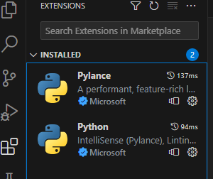
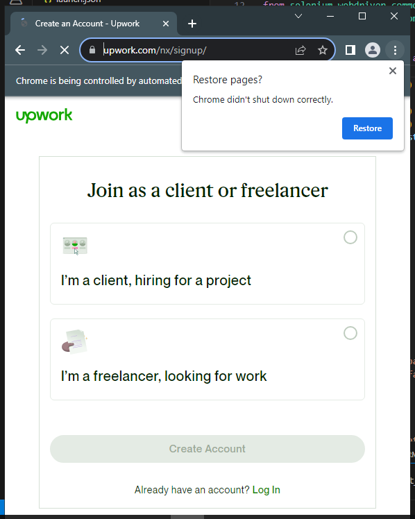
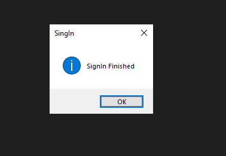
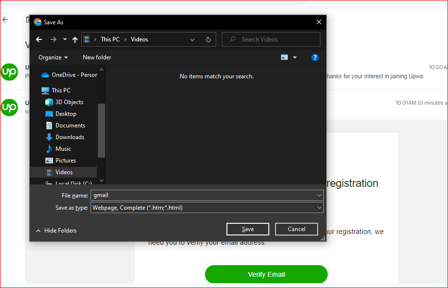
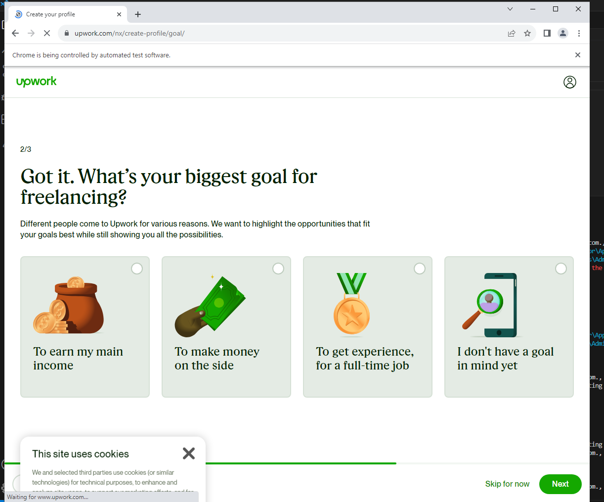
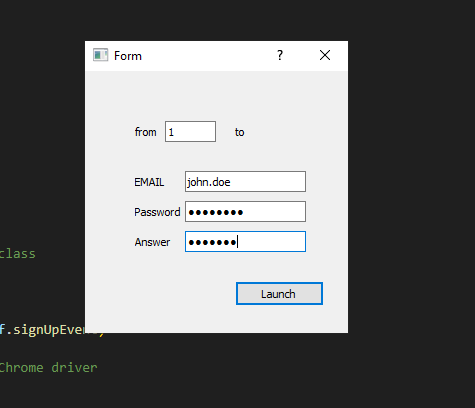

### Setting Up the Environment on Your VPS

 **1.** Install Python Version 3.7 or Higher

 **2.** Configure PowerShell as Administrator

- Open PowerShell as an administrator.
- Execute the following command to set the execution policy:

```bash
 Set-ExecutionPolicy RemoteSigned -Force
```

 **3.** Install Required Python Packages

```bash
pip install -r requirements.txt
```

 **4.** Enhance VS Code with Python Extension

- Install the Python extension for Visual Studio Code to facilitate development.


 **5.** Organize Your Data

- Place your resume file as `resume.docx` in the documents folder.
- Store the desired fake photos in the `documents/avatar` folder, with filenames ranging from `1.jpg` to `10.jpg`.
- Create a new directory named `Default` within the `C:/temp2/`  irectory, and proceed to copy the `Preferences` file into the path `C:/temp2/Default/Preferences`.

### Starting the Process

 **1.** Open `data.json` and configure your preferences

```bash
"us_only":  true,       # bot will create USA account
"random":   true,       # Random selection of first name, last name, and photo for account
"Email": "john.doe",    # it means jone.doe@gmail.com
"skills": []            # you can add skills up to 15
```

 **2.** Bot Execution

- Launch the bot.py script using `Ctrl + F5` in VS Code.
- Use `Ctrl + Shift + ~` to trigger signups.

- The bot will automate Chrome to create multiple accounts based on your `data.json` configuration.
- A message box indicates successful signup completion.


 **3.** HTML to JSON Conversion on local PC
After signup completion, your Gmail will receive verification requests.

- Open the Upwork verification email and press Ctrl+S to save the HTML content as `gmail.html`.

- In `GamilToJson folder`, Run `gmailToJson.py` on your local PC to convert HTML emails to JSON format.
If the program success, you could see your fake emails and verify links on `email.json`

 **4.** Account Verification and Creation

- Return to the VPS environment.
- Copy content from local PC's email.json to `email-verify.json` on the VPS.
- Press `Ctrl + Shift + V` to verify and make your account.
The bot will verify and create your account automatically


 **5.** Program Launch
Execute `launch.py` to open the UI.
Fill details and click launch; program automates login.


With these steps completed, your setup is ready to enable seamless account creation, verification, and project bidding on Upwork.

Happy bidding!
